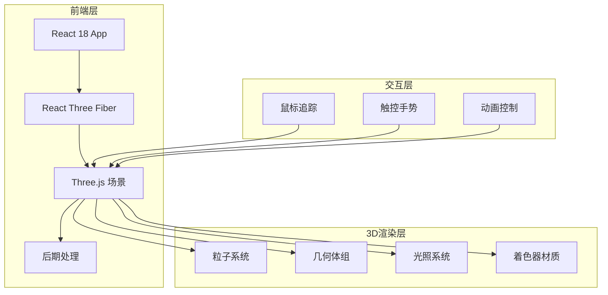
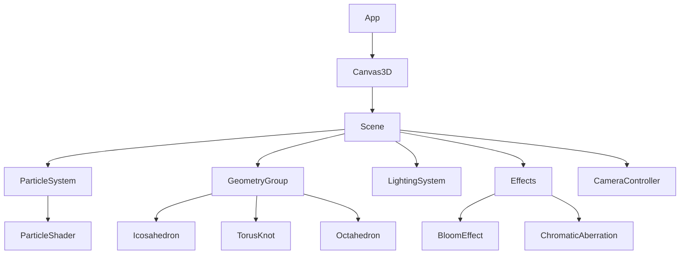

# 技术架构文档

## 1. 架构设计



## 2. 技术说明
- **前端框架**: React 18 + TypeScript + Vite
- **样式方案**: Tailwind CSS 3
- **3D渲染**: Three.js + React Three Fiber + React Three Drei
- **后期处理**: @react-three/postprocessing
- **动画**: @react-spring/three
- **初始化工具**: Vite

## 3. 路由定义
| 路由 | 用途 |
|-----|------|
| / | 主页面，包含完整3D场景体验 |

## 4. 核心组件架构



## 5. 3D场景配置

### 5.1 粒子系统
- 粒子数量: 5000-8000
- 形状: 自定义着色器渲染的圆形粒子
- 运动: Perlin噪声驱动
- 交互: 鼠标吸引/排斥力场

### 5.2 几何体
- 二十面体 (Icosahedron): 金属材质，反射环境
- 环面结 (TorusKnot): 玻璃材质，折射效果
- 八面体 (Octahedron): 发光材质，脉冲动画

### 5.3 光照
- 环境光: 低强度，全局照明
- 点光源 x 3: 动态环绕，不同颜色
- 聚光灯: 跟随鼠标位置

### 5.4 后期处理
- UnrealBloomPass: 辉光效果
- ChromaticAberration: 色差效果
- Vignette: 暗角效果

## 6. 性能优化策略
- 使用 InstancedMesh 优化几何体渲染
- 粒子使用 BufferGeometry
- 着色器材质避免每帧更新
- 移动端检测并降低粒子数量
- 使用 requestAnimationFrame 控制动画
- 视锥剔除自动启用

## 7. 文件结构
```
src/
├── components/
│   ├── Canvas3D.tsx          # 主3D画布
│   ├── Scene.tsx             # 场景配置
│   ├── ParticleSystem.tsx    # 粒子系统
│   ├── GeometryGroup.tsx     # 几何体组
│   ├── LightingSystem.tsx    # 光照系统
│   ├── Effects.tsx           # 后期处理
│   └── UI/
│       ├── ControlPanel.tsx  # 控制面板
│       └── Overlay.tsx       # 标题覆盖层
├── shaders/
│   ├── particle.vert         # 粒子顶点着色器
│   └── particle.frag         # 粒子片段着色器
├── hooks/
│   └── useMouse.ts           # 鼠标交互钩子
├── App.tsx
└── main.tsx
```
